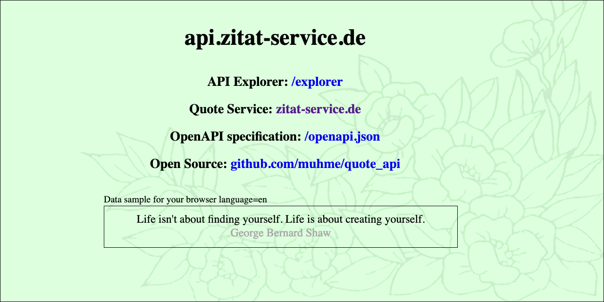

# api.zitat-service.de



API [api.zitat-service.de](https://api.zitat-service.de) for the quote collection of the user community [zitat-service.de](https://www.zitat-service.de). The endpoints with the different parameters are documented (and testable) with the [API explorer](https://api.zitat-service.de/v1/explorer/).

Or simple try: <a href="https://api.zitat-service.de/v1/quote_html?language=en&style=https://www.zitat-service.de/quote.css">api.zitat-service.de/v1/quote_html?language=en&style=https://www.zitat-service.de/quote.css</a>

## Docker Containers

There is a Docker based test and development environment prepared. [Docker](https://www.docker.com/), [git](https://git-scm.com/), [node](https://nodejs.org/) >= v20 and [npm](https://www.npmjs.com/) must be installed (under Microsoft Windows in WSL2). To create your own test and development environment run:

```
git clone https://github.com/muhme/quote_api
cd quote_api
scripts/create.sh
```

Then you should have three Docker containers running:

```
docker ps
IMAGE                        PORTS                        NAMES
quote_api-nodeapp            0.0.0.0:3000->3000/tcp       quote_api_nodeapp
phpmyadmin/phpmyadmin        0.0.0.0:3001->80/tcp         quote_api_mysqladmin
quote_api-mariadb            0.0.0.0:3002->3306/tcp       quote_api_mariadb
```

- quote_api_mariadb – MariaDB database server
  - admin user is root/root
  - internal database port 3306 is mapped to host's port 3002
  ```sh
    mysql -h localhost -P 3002 -u quote_development -pquote_development
  ```
  - Database quote_development
    - user quote_development/quote_development
    - contains cleaned live database import from August 2023
- quote_api_mysqladmin – phpMyAdmin (user root/root)
  - http://localhost:3001
- quote_api_nodeapp – Node.js LoopBack4 application running by PM2
  - http://localhost:3000
  - there you have OpenAPI spec and the API explorer

This was last tested on macOS 15 (Sequoia), Ubuntu 22.04 LTS (Jammy Jellyfish) and Windows 11 with WSL2 and Ubuntu 22.04 LTS.

## Logging

Logging goes via Winston into file. By default log level is `DEBUG` and filename is `development.log`. Is the environment variable `NODE_ENV` set to `production`, log level is set to `INFO` and filename is `production.log`.

## Debug

For `LoopBack4` debug strings can be set as environment variables. For example `DEBUG=loopback:connector:*` shows database queries and responses.

## Tests

Acceptance, unit and integration tests exist only as examples. But more than 100 end-to-end tests are existing. Run all the tests with:

```sh
scripts/test.sh
```

### K6

There is a script for load testing with [K6](https://k6.io/). This runs home, OpenAPI spec, API explorer and all endpoints with all parameter combinations.

First example: local on an 8-core Docker running 50 virtual users in parallel for three minutes, more than 100,000 requests are executed in an average of 25 ms (max 423 ms). The Node.js container is using only a quarter of the CPU and the MariaDB container using three quarters. With 90% HTTP status 200. The remaining 10% are HTTP Status 404 from the /quote endpoint combinations of language with author/user/category ID for which there are no matches.

Second example: small 1-CPU/1 GB RAM VPS remote, with average 25 ms ping time. 7 virtual users in parallel result in VPS 85% CPU load. 10.770 requests are executed in the three minutes. Requests are responded in average 65 ms (max 635 ms).

```sh
cd src/__tests__/k6
k6 -u 50 -d 3m run script.js
```

All requests can be shown with env variable SHOW_REQUESTS:

```sh
cd src/__tests__/k6
k6 -e SHOW_REQUESTS=true -d 1s run script.js
Testing http://localhost:3000
Fetched 5 languages: de,en,es,ja,uk
Fetched 60 users
Fetched 562 authors
Fetched 570 categories
19:03:53.311 GET 404    6 http://localhost:3000/quote?language=ja&authorId=599
19:03:53.403 GET 200    7 http://localhost:3000/quote
19:03:53.467 GET 200    8 http://localhost:3000/categories?language=en&starting=Ang
19:03:53.510 GET 200    8 http://localhost:3000/quote
19:03:53.577 GET 200    8 http://localhost:3000/quote?language=de
19:03:53.676 GET 200    5 http://localhost:3000/quote?language=de&userId=27
19:03:53.756 GET 200    6 http://localhost:3000/
19:03:53.808 GET 200    6 http://localhost:3000/quote?language=uk
19:03:53.830 GET 404    5 http://localhost:3000/quote?language=en&userId=21
19:03:53.930 GET 200    4 http://localhost:3000/explorer
19:03:54.017 GET 200    5 http://localhost:3000/openapi.json
19:03:54.035 GET 200    2 http://localhost:3000/languages
19:03:54.111 GET 200    2 http://localhost:3000/explorer
19:03:54.155 GET 200    4 http://localhost:3000/categories?language=ja&starting=%E8%A8%BC%E5%88%B8%E5%8F%96%E5%BC%95
19:03:54.181 GET 200    7 http://localhost:3000/quote?language=de
19:03:54.265 GET 200    6 http://localhost:3000/quote?language=uk
```

## History

- August 18, 2025 v1.1.7 npm update
- January 29, 2025 v1.1.6 npm update
- August 14, 2024 v1.1.5 npm update
- February 27, 2024 v1.1.4 npm update
- Januar 24, 2024 v1.1.3 npm update
- October 31, 2023 v1.1.2 fixing validator.swagger.io errors ([Issue #5](../../issues/5))
- October 30, 2023 v1.1.1 [/v1/authors](https://api.zitat-service.de/v1/authors) list is now sorted by lastname first and firstname second ([Issue #4](../../issues/4))
- October 3, 2023 v1.1.0 with additional endpoint [/v1/quote_html](https://api.zitat-service.de/v1/quote_html)
- September 20, 2023 v1.0.0 launched with six JSON endpoints
- August 2023 application was initial generated by using [LoopBack 4 CLI](https://loopback.io/doc/en/lb4/Command-line-interface.html) with the
  [initial project layout](https://loopback.io/doc/en/lb4/Loopback-application-layout.html)

[-@2x.png>)](http://loopback.io/)

## Contact

Please, don't hesitate to ask if you have any questions or comments.
